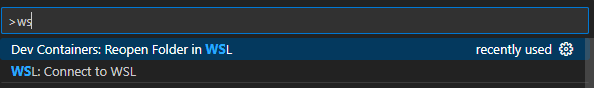
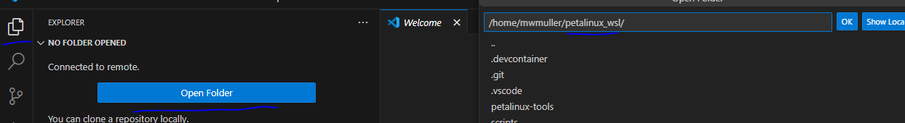
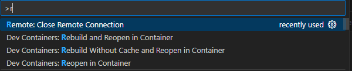
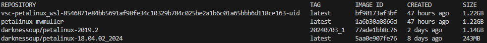

## WSL/Docker Installation Pre-Requisites **(Must be done first)**
1) Open the wsl-localenv folder to install WSL and Docker


## Petalinux Installer

1) To downlaod the petalinux-installer (if not done so already), go here: https://account.amd.com/en/forms/downloads/xef.html?filename=petalinux-v2019.2-final-installer.run
2) Transfer the downloaded installer to this repo. ```/home/\<username\>\petalinux_wsl```
#
## Setup the Devcontainer
Before you can run the required scripts and tools you'll need to reopen your env in the devcontainer
#
### Note:
    !!!This process needs to be done each time you want to use the devcontainer!!!
1) In the bottom left of vc-code you can click the "><" -> ```Connect to WSL``` -> Select the ```petalinx-wsl``` folder <br />
    - Alternativly ```ctrl + shift + p``` -> ```Connect to WSL``` <br />

    - Select the proper repository for WSL <br />


2) In the bottom left of vc-code you can click the "><" -> ```Dev-container > Reopen in container``` <br />
    - ```ctrl + shift + p``` -> ```Dev-container: Reopen in container```
    - If you make changes to the dockerfile, it's recommended to use ```Dev-containter: Rebuild Without Cache and Reopen in Container``` <br />


- To open a new ```bash``` terminal you can use the key-bind ```ctrl + shift + ` ```

## Petalinux setup **(Requires Petalinux-installer)**
1) Run the ```./first-time-ptlnx-setup.sh``` to setup the petalinux environment

**(OPTIONAL)**
- You can include your own ```version``` of petalinux with ```-v```: ```./first-time-ptlnx-setup.sh -v petalinux-v20xx.x-installer.run```
- The default directory for the petalinux installation is ```${WorkingDirectory}/petalinux-tools``` <br />
You can update this with ```-p``` and provide the desired path: ```./first-time-ptlnx-setup.sh -p <newPath>```
### REQUIRED ###
#
There are ```2``` instances during installation where user input is required: 
- Checking Petalinux installer integrity
- Petalinux installation
**Enter ```q``` to exit ```eula.txt``` when it pops up and type ```y```**

### Download BSP (If no XSA file)
1) You'll need to download the specific BSP for your board.
2) This can be found here: https://www.xilinx.com/support/download/index.html/content/xilinx/en/downloadNav/embedded-design-tools/archive.html -> **2019.2**

### Troubleshooting/Help
1) Here is the link to the 2019.2 Petalinux installation guide: https://docs.amd.com/v/u/2019.2-English/ug1144-petalinux-tools-reference-guide


### Low Disk Storage
1) If you make changes to the dockerfiles or rebuild multiple times you may acquire an excess of images, view them with ```docker images```

- These are the **required** images
2) Any additional **old** images can be safely removed with ```docker image prune```
3) If you have extra images outside the ones above, you can force remove them with ```docker image rm <imageID> -f```


## Using petalinux commands
1) Reference the [Petalinux Guide](PetalinuxGuide.md) for creating, configuring, building your project